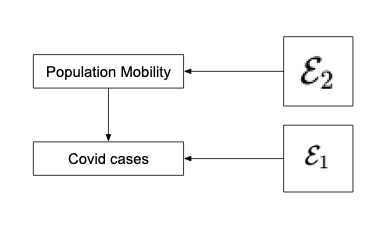

```{r load_packages, message=FALSE, include=FALSE, warning=FALSE}
library(tidyverse)
library(ggplot2)
library(sandwich)
library(lmtest)
library(fec16)
library(qwraps2)
library(dplyr)
library(gridExtra)
library(hrbrthemes)
# Load the package
library(lubridate)
library(patchwork)
library("data.table")
library(readxl)
library(stargazer)
library(readr)
library(zoo)
theme_set(theme_minimal())
options(qwraps2_markup = "markdown")
knitr::opts_chunk$set(dpi = 300)
knitr::opts_chunk$set(echo = TRUE)
```

```{r get_data, echo=FALSE ,message=FALSE, include=FALSE, warning=FALSE}
col_names = c('STATE', 'POSTCODE', 'FIPS', 'STEMERG', 'STEMERGEND', 'CLSCHOOL', 'CLDAYCR', 'OPNCLDCR', 'CLNURSHM', 'STAYHOME', 'STAYHOMENOGP', 'END_STHM', 'CLBSNS', 'CURFEW', 'END_BSNS', 'RELIGEX', 'FM_ALL', 'FM_ALL2', 'FMFINE', 'FMCITE', 'FMNOENF', 'FM_EMP', 'FM_END', 'FM_STP', 'ALCOPEN', 'ALCREST', 'ALCDELIV', 'GUNOPEN', 'CLREST', 'ENDREST', 'RSTOUTDR', 'CLGYM', 'ENDGYM', 'CLMOVIE', 'END_MOV', 'CLOSEBAR', 'END_BRS', 'END_HAIR', 'END_RELG', 'ENDRETL', 'CURFEWEND', 'BCLBAR2', 'CLBAR2', 'CLMV2', 'CLHAIR2', 'CLGYM2', 'CLRST2', 'ENDREST2', 'END_BRS2', 'END_CLGYM2', 'END_CLMV2', 'CLBAR3', 'CLRST3', 'END_CLRST3', 'QRSOMEST', 'QR_ALLST', 'QR_END', 'VAC_PLAN', 'VAC_HCW', 'VAC_HCS', 'VAC_HHC', 'VAC_AHC', 'VAC_LTC', 'VAC_EMS', 'VAC_FF', 'VAC_LAW', 'VAC_CORR', 'VAC_INC', 'VAC_SHELTER', 'VAC_75', 'VAC_65', 'VAC_HR', 'VAC_K12', 'VAC_HIGHED', 'VAC_PT', 'VAC_FOOD', 'VAC_GROCERY', 'VAC_ESSWORK', 'VAC_ADDWORK', 'VAC_PUB', 'AGEPRIORITY', 'PROOFWORK', 'PROOFAGE', 'PROOFRES', 'PENALTY', 'EXPANDADMIN', 'EMSTART', 'EMEND', 'EMSTART2', 'EMEND2', 'EMSTART3', 'EMEND3', 'FREEZEINIT', 'LIFTINIT', 'FREEZEINIT2', 'LIFTINIT2', 'COURTCLOSE', 'COURTOPEN', 'COURTCLOSE2', 'COURTOPEN2', 'FREEZEENF', 'LIFTENF', 'FREEZEENF2', 'LIFTENF2', 'C19START', 'C19END', 'C19START2', 'C19END2', 'CARESSTART', 'CARESEND', 'CDCSTART', 'CDCEND', 'SMSTART', 'SMEND', 'SMSTART2', 'URSTART', 'UREND', 'SNAPALLO', 'SNAPEBT', 'SNAPSUSP', 'SNAPTLW', 'MED1135W', 'ACAENROL', 'PREVTLHL', 'TLHLAUD', 'TLHLMED', 'CHIPLKOT', 'LKOTSUS', 'TEST', 'CASE', 'HOSP', 'DEATH', 'VACCINE', 'TESTAIAN', 'CASEAIAN', 'HOSPAIAN', 'DEATHAIAN', 'VACCINEAIAN', 'VISITPER', 'VISITATT', 'VISITRES', 'NOCOPAY', 'NOPAYCOV', 'NOPAYALL', 'YESCOPAY', 'ELECPRCR', 'ENDELECP', 'ELECNOSTART', 'ELECPRCR2', 'ENDELECP2', 'WTPRD', 'WV_WTPRD', 'REI_WTPRD', 'WV_WKSR', 'REI_WKSR', 'UIQUAR', 'UIHIRISK', 'UICLDCR', 'UIEXTND', 'UIMAXAMT', 'UIMAXEXT', 'UIMAXDUR', 'UIMAXCAR', 'EBSTART', 'EBEND', 'TUR', 'TURPRIOR', 'TURPRIOR2', '20EBSTART', '20EBEND', 'UIMINBP', 'UIQTRNEED', 'UIOUTHQBP', 'UIREQBPL2Q', 'UIBPEARN300', 'UITAXWA', 'UIMINTAXR', 'UIMAXTAXR', 'UIAVGBFTAUG', 'LMABRN', 'TLHlBUPR', 'EXTOPFL', 'HMDLVOP', 'TLHLCL24', 'EXCEMORP', 'WVDEAREQ', 'PDSKLV', 'MEDEXP', 'POPDEN18', 'POP18', 'SQML', 'HMLS19', 'UNEMP18', 'POV18', 'RISKCOV', 'DEATH18', 'MH19', 'CASSTATE', 'AIANRESN', 'VBMEXC', 'VBMSIG', 'VBMPERM', 'VBMAUTOBAL', 'VBMAUTOAP', 'VBMGENELEC', 'CASCLOSE', 'CASOPEN', 'CASCLOSE2', 'CASOPEN2', 'CASTRIBCAS', 'MINWAGE2015', 'MINWAGE2016', 'MINWAGE2017', 'MINWAGE2018', 'MINWAGE2019', 'MINWAGEJAN2020', 'MINWAGEJUL2020', 'MINWAGESEP2020', 'MINWAGEOCT2020', 'TIPMINWAGE2020', 'MINWAGE2021', 'SMALLBUSMINWAGE')
col_types= c('text', 'text', 'numeric', 'date', 'date', 'date', 'date', 'date', 'date', 'date', 'date', 'date', 'date', 'date', 'date', 'numeric', 'date', 'date', 'numeric', 'numeric', 'numeric', 'date', 'date', 'date', 'numeric', 'date', 'date', 'numeric', 'date', 'date', 'numeric', 'date', 'date', 'date', 'date', 'date', 'date', 'date', 'date', 'date', 'date', 'date', 'date', 'date', 'date', 'date', 'date', 'date', 'date', 'date', 'date', 'date', 'date', 'date', 'date', 'date', 'date', 'date', 'text', 'text', 'text', 'text', 'text', 'text', 'text', 'text', 'text', 'text', 'text', 'text', 'text', 'text', 'text', 'text', 'text', 'text', 'text', 'text', 'text', 'text', 'numeric', 'numeric', 'numeric', 'numeric', 'numeric', 'numeric', 'date', 'date', 'date', 'date', 'date', 'date', 'date', 'date', 'date', 'date', 'date', 'date', 'date', 'date', 'date', 'date', 'date', 'date', 'date', 'date', 'date', 'date', 'date', 'date', 'date', 'date', 'date', 'date', 'date', 'date', 'date', 'date', 'date', 'date', 'numeric', 'date', 'date', 'numeric', 'date', 'date', 'numeric', 'numeric', 'numeric', 'numeric', 'numeric', 'numeric', 'numeric', 'numeric', 'numeric', 'numeric', 'numeric', 'numeric', 'date', 'date', 'date', 'numeric', 'numeric', 'numeric', 'numeric', 'date', 'date', 'date', 'date', 'date', 'numeric', 'date', 'date', 'numeric', 'numeric', 'numeric', 'numeric', 'numeric', 'numeric', 'numeric', 'numeric', 'numeric', 'numeric', 'date', 'date', 'numeric', 'numeric', 'numeric', 'date', 'date', 'numeric', 'numeric', 'numeric', 'numeric', 'numeric', 'numeric', 'numeric', 'numeric', 'numeric', 'text', 'date', 'date', 'date', 'date', 'date', 'date', 'numeric', 'numeric', 'numeric', 'numeric', 'numeric', 'numeric', 'numeric', 'numeric', 'numeric', 'numeric', 'numeric', 'numeric', 'numeric', 'numeric', 'numeric', 'numeric', 'numeric', 'numeric', 'date', 'date', 'date', 'date', 'date', 'numeric', 'numeric', 'numeric', 'numeric', 'numeric', 'numeric', 'numeric', 'numeric', 'numeric', 'numeric', 'numeric', 'numeric', 'numeric')
  
State_Policies <- read_excel("../data/raw/State_Policy_database.xlsx", skip = 5, col_names = col_names, col_types = col_types)
mobility_raw <- read_csv("../data/raw/2020_US_Region_Mobility_Report.csv")
mask_use <- fread("../data/raw/mask-use-by-county.csv")
NYT_Data <- fread("../data/raw/us-states.csv")
NYT_Data[,date:=as.Date(date)]
```
```{r clean_data, echo=FALSE ,message=FALSE, include=FALSE, warning=FALSE}
min_date <- as.Date('2020-02-15')
max_date <- as.Date('2020-07-15')

# The chance all five people are wearing masks in five random encounters is calculated by assuming that survey respondents who answered ‘Always’ were wearing masks all of the time, those who answered ‘Frequently’ were wearing masks 80 percent of the time, those who answered ‘Sometimes’ were wearing masks 50 percent of the time, those who answered ‘Rarely’ were wearing masks 20 percent of the time and those who answered ‘Never’ were wearing masks none of the time.

mask_use <- mask_use %>% mutate(
  mask_prob = ALWAYS + FREQUENTLY * 0.8 + SOMETIMES * 0.5 + RARELY * 0.2,
  fips = as.integer(COUNTYFP/1000),
)

mask_use_states <- mask_use %>% group_by(fips) %>% summarise(
  mask_prob = mean(mask_prob),
)

cases_states <- NYT_Data
# Yes, again to date
cases_states$date <- as.Date(cases_states$date)
cases_states <- cases_states[cases_states$date == max_date,]
cases_states <- cases_states %>% mutate(
  total_cases = cases
)
cases_states <- cases_states %>% inner_join(mask_use_states, by=c("fips"))

# For mobility we need first to keep only state level data
mobility <- mobility_raw[mobility_raw$date >= min_date & mobility_raw$date <= max_date,]
mobility_states <- mobility %>% filter(is.na(census_fips_code))  %>% filter(!is.na(sub_region_1))
mobility_states$state = mobility_states$sub_region_1

mobility_states <- mobility_states %>% group_by(state) %>% summarise(
  workplaces = mean(workplaces_percent_change_from_baseline, na.rm = TRUE),
  transit = mean(transit_stations_percent_change_from_baseline, na.rm = TRUE),
  residential = mean(residential_percent_change_from_baseline, na.rm = TRUE),
  grocery = mean(grocery_and_pharmacy_percent_change_from_baseline, na.rm = TRUE),
  parks = mean(parks_percent_change_from_baseline, na.rm = TRUE)
)


#Now lets get Pop Density and others
policies <- State_Policies %>% mutate(
  state=STATE, 
  popden=POPDEN18,
  pop=POP18,
  fm_start=case_when(
    as.Date(coalesce(FM_EMP,FM_ALL))==as.Date('1899-12-31') ~ as.Date('2099-12-31'),
    TRUE ~ as.Date(coalesce(FM_EMP,FM_ALL))
    ),
  fm_start2=case_when(
    as.Date(FM_ALL2)==as.Date('1899-12-31') ~ as.Date('2099-12-31'),
    TRUE ~ as.Date(FM_ALL2)
    ),
  fm_end=case_when(
    as.Date(FM_END)==as.Date('1899-12-31') ~ as.Date('2099-12-31'),
    TRUE ~ as.Date(FM_END)
    ),
  stay_home=case_when(
    as.Date(STAYHOME)==as.Date('1899-12-31') ~ as.Date('2099-12-31'),
    TRUE ~ as.Date(STAYHOME)
    ),
  )  %>% select(state, pop, popden, fm_start, fm_start2, fm_end, stay_home)
policies <- policies[!is.na(policies$popden),]
policies$fm_to_date <- as.numeric(max_date - policies$fm_start)
policies$fm2_to_date <- as.numeric(max_date - policies$fm_start2)
policies$fm_end_to_date <- as.numeric(max_date - policies$fm_end)
policies <- policies %>% mutate(
  fm_to_date=case_when(
    fm_to_date < 0 ~ 0,
    TRUE ~ fm_to_date
    ),
  fm2_to_date=case_when(
    fm2_to_date < 0 ~ 0,
    TRUE ~ fm2_to_date
    ),
  fm_end_to_date=case_when(
    fm_end_to_date < 0 ~ 0,
    TRUE ~ fm_end_to_date
    ),
  stay_home=case_when(
    stay_home > max_date ~ 0,
    TRUE ~ 1
    ),
  mask_policy=case_when(
    fm_start >= max_date ~ 0,
    TRUE ~ 1
    )
  )
policies$mask_days <- policies$fm_to_date - policies$fm_end_to_date + policies$fm2_to_date


# Now we can join
data <- cases_states %>% inner_join(mobility_states, by=c("state"))
data <- data %>% inner_join(policies, by=c("state"))
data$cases_per_100k <- (data$total_cases / (data$pop)) * 100000
data <- data %>% select(state, cases_per_100k, workplaces, transit, grocery,
                        parks, residential, mask_policy, mask_prob)
```


# Introduction

### Overview
The Covid-19 pandemic has taken more than 2.5 million lives worldwide. In the U.S.
alone, more than half a million people died because of it. COVID-19 is thought to 
spread mainly through close contact from person to person, including among people 
who are physically near each other (within about 6 feet).[1]

As the virus spread, many cities and other areas have implemented a shutdown policy
that significantly restricted the mobility of the population. Specifically, many
companies have opted for a complete work-from-home policy.

As a team of Data Scientists, we're interested in assessing the effectiveness of
restricting mobility in controlling the spread of Covid-19.

### Research Question

Rather than investigating the effect of social distancing on a micro and personal
interaction level, we are interested in its effect on a policy level. Specifically,
the Research Question we're asking is:
```
How much did restricting social mobility help in controlling the spread of COVID?
```

The basic causal theory we're working under can be expressed by the diagram below:
```{r casual_theory, echo=FALSE, fig.align="center", out.width="50%", fig.cap="The Basic Causal Theory"}

```

### Operationalization
To operationalize the research question, we propose the following plan for the
causal models.

**Firstly**, we will use the New York Times[2] Covid-19 data for the number of
Covid cases per State. And we will use the Covid-19 Community Mobility Report[3]
for the population mobility scores. For the base model, we will use the "residential
mobility score" as a relatively stable representative of the general population's
social mobility.

**Secondly**, mobility have drastically different effect on the spread
of the virus depending on the population density. Thus, we believe that having
the raw number of cases as the outcome variable can be misleading. Therefore,
we will be using the number of cases per 100,000 residents as the outcome variable
to normalize the population density. The population density data will 
come from the COVID-19 US State Policy Database[4].

More formally, our base model will assume a causal relationship of the form:
$$
cases\_per\_100k\_residents = \beta_0 + \beta_1 residential\_mobility\_score
$$
where each data point will represent a State in the U.S., and the outcome variable
will be the total number of Covid-19 cases per 100,000 residents for that state
since 2020-02-15 up until 2020-07-15, when the mask wearing survey[5] was taken.

And the independent variable will be the **average** residential mobility score
of the state in the same time period.

**Finally**, for a more advanced model, we propose to use some control variables to assess
the difference mobility score makes in relation to other factors, notably we'll
include two factors about facial masks. One is the probability of someone wearing
a mask, gathered from New York Time county level data, and the other is whether
the mask wearing mandate has been in place for the state.

The probability of people wearing masks is calculated by assuming 
that survey respondents who answered ‘Always’ were wearing masks all of the time, 
those who answered ‘Frequently’ were wearing masks 80 percent of the time, 
those who answered ‘Sometimes’ were wearing masks 50 percent of the time, 
those who answered ‘Rarely’ were wearing masks 20 percent of the time and 
those who answered ‘Never’ were wearing masks none of the time.

For the most inclusive model, we will explore all the other mobility scores,
including to workplaces, transit, parks, and grocery & pharmacy.


# The models

### Data Exploration

First of all, we gather and transform all the data identified from above to State
level aggregated in the time range of 2020-02-15 to 2020-07-15.

The table below shows a summary of all the variables we intend to use.
```{r summary, echo=FALSE, results = "asis", fig.align="center", out.width="90%", fig.cap="Data Summary"}
variables <- data %>% select(-c('state'))
summary_table(variables)
```

As can be seen, all the variables have their means and medians very close to each other, that suggests
that there is no severe skewness.

By looking at the scatter plots of the various mobility scores, we notice that `workplaces`
is the inverse of the `residential` mobility variable. And we see in Figure 2 
that they have almost perfect inverse correlation, having a linear correlation
coefficient of $-0.93$. Therefore we would only use one out of these two.

```{r scatter_plots, echo=FALSE, message=FALSE, warning=FALSE, fig.cap='Scatter Plots for Cases per 100k and selected mobility variables', fig.pos='!h', fig.align="center", fig.height = 3}
# cases is cumulative
# workplaces is the inverse of residential,
# but the scale of residential is better suited for OLS
p1 <- ggplot(data, aes(x=workplaces, y=cases_per_100k)) + 
  geom_point(color="#69b3a2") + geom_smooth(se = FALSE) 
p2 <- ggplot(data, aes(x=residential, y=cases_per_100k)) + 
  geom_point(color="#69b3a2") + geom_smooth(se = FALSE)

p1 + p2
```

In Figure 3, plotting the conditional expected value of `cases_per_100k` against `residential`
and from the data shows a reasonably linear relationship, hence we decide to use it as
the representative of the mobility scores. Other scores also show nice linear
relationships. We will use them in the most inclusive model.

```{r scatter_plots_lm, echo=FALSE, message=FALSE, warning=FALSE, fig.cap='Scatter Plots for Cases per 100k and selected mobility variables (regression line and standard errors)', fig.pos='!h', fig.align="center", fig.height = 3}
# cases is cumulative
# workplaces is the inverse of residential,
# but the scale of residential is better suited for OLS

p1 <- ggplot(data, aes(x=residential, y=cases_per_100k)) + 
  geom_point(color="#69b3a2") + geom_smooth(method = lm) 
p2 <- ggplot(data, aes(x=transit, y=cases_per_100k)) + 
  geom_point(color="#69b3a2") + geom_smooth(method = lm)
p3 <- ggplot(data, aes(x=parks, y=cases_per_100k)) + 
  geom_point(color="#69b3a2") + geom_smooth(method = lm)

p1 + p2 + p3
```

### The Linear Models

At this point in time during the pandemic, the U.S. was registering its second wave of Covid-19 cases
and non-essential business were still closed in most of the sates.
One way to explain this relationship is that in the states where the residential mobility score increased,
people were not sheltering at their homes. Instead people were going out with friends and family,
thus spreading the virus.

### Model One

In our initial model we will use the residential mobility score and cases per 100,000 residents:
$$
cases\_per\_100k\_residents = \beta_0 + \beta_1 residential\_mobility\_score
$$

```{r simple_model, echo=FALSE, message=FALSE, warning=FALSE}
model_one <- lm(cases_per_100k ~ residential, data=data)
summary(model_one)
```

Here we have a significant p-value withe residential mobility score. So it seems
that one point increase in the residential mobility score leads to, on average,
almost 96 more Covid cases.

### Model Two

In the second model we wanted to test if the probability of wearing a mask would
have a significant impact on the amount of Covid-19 cases. 
Although by looking at the scatter plot of Cases per 100k and mask wearing probability
there is no clear relationship, and the slope of the OLS line has the opposite direction to
what our intuition tell us.

```{r mask_prob, echo=FALSE, message=FALSE, warning=FALSE, fig.cap='Scatter Plots for Cases per 100k and mask wearing probability', fig.pos='!h', fig.align="center", fig.height=3}
# cases is cumulative
# workplaces is the inverse of residential,
# but the scale of residential is better suited for OLS
p1 <- ggplot(data, aes(x=mask_prob, y=cases_per_100k)) + 
  geom_point(color="#69b3a2") + geom_smooth(se = FALSE) 
p2 <- ggplot(data, aes(x=mask_prob, y=cases_per_100k)) + 
  geom_point(color="#69b3a2") + geom_smooth(method=lm)
p1|p2
```

So, our second model contains the residential mobility score, the face mask wearing
probability, as well as the control variable of whether the mask policy has been in place.

\begin{align}
cases\_per\_100k\_residents &= \beta_0\\
&+ \beta_1 residential\_mobility\_score \\
&+ \beta_2 mask\_wearing\_probability\\
&+ \beta_3 mask\_policy\_in\_effect
\end{align}
```{r model_two, echo=FALSE, message=FALSE, warning=FALSE}
model_two <- lm(cases_per_100k ~ residential + mask_policy + mask_prob , data=data)
summary(model_two)
```

The interesting thing here is that it shows, the probability of wearing a mask (`mask_prob`)
seems to cause more cases, however the mask policy being in place cases fewer cases.

However neither variables are statistically significant, which give us more confidence
that the mobility score is still the most important.

### Model Three

Our secondary question was if the other mobility variables could have a significant impact
on the outcome variable. As previously mentioned, the workplace mobility score is too close
to perfect linearity with residential, so we'll leave it out, but we can run the model
against all other mobility scores.


\begin{align}
cases\_per\_100k\_residents &= \beta_0\\
&+ \beta_1 residential\_mobility\_score\\
&+ \beta_2 mask\_wearing\_probability\\
&+ \beta_3 mask\_policy\_in\_effect\\
&+ \beta_4 parks\_mobility\_score\\
&+ \beta_5 grocery\_mobility\_score\\
&+ \beta_6 transit\_mobility\_score
\end{align}

```{r model_three, echo=FALSE, message=FALSE, warning=FALSE}
model_three <- lm(cases_per_100k ~ residential + mask_policy + mask_prob + parks + grocery + transit, data=data)
summary(model_three)
```

Perhaps somewhat surprisingly, all the prior variables retained their previous
directions under earlier models. Residential mobility remains very significant.
At the same time, higher mobility in grocery shopping and public transit seam to
cause Covid cases to increase, whereas going to parks seem to cause fewer cases,
although none of these variables are statistically significant to prove very useful.


### The Regression Table
The models above are summarized in the following regression table.

``` {r echo=FALSE, message=FALSE, warning=FALSE, results='asis'}
stargazer::stargazer(model_one, model_two, model_three, 
  title = 'Comparisoin of Regression Models', header = FALSE)
```

# Model Limitations

### Time Series

The Research Question under study is well suited for a time series analysis. The
initial discussion and work, were poised to well take off in including a weekly 
average and correlation with the cases offset by couple of weeks. As per the 
instruction and the limited machinery in place, the team has decided to take 
an average for the states from a time window where all the variables were produced
and use it in the model.

### Reverse Causality

The Research Question under study finds relationship between Mobility and COVID
cases. But, there is also the reverse path where more COVID cases creates fear
among people. Thus, people limiting outdoor activities.

### All Percent drops are not equal

A 10% drop in mobility is really good for sparsely populated regions to go below
a certain threshold in transmitting the virus. The same cannot be applied to 
densely populated cities. Thus, the non-linearity in the measures taken vs impact 
seen is omitted.

### Classic Linear Model assumptions

#### 1. IID Sampling
Given that each data point is aggregated from a U.S. state, the number of cases
and mobility are largely independent. However the mask wearing policy as well as
the populations willingness to carry them out do tend to cluster somewhat based
on geography and political leanings, so they can be argued to be less independent
of each other.

#### 2. Linear Conditional Expectation 

By looking at the predicted vs. residuals of the model it looks that relationship 
is reasonably linear.

```{r residuals, echo=FALSE, message=FALSE, warning=FALSE, fig.cap='Residuals vs Fitted plot for Model One', fig.pos='!h', fig.align="center"}
plot(model_one, which = 1)
```

####  3. No Perfect Collinearity
  
```{r, echo=FALSE, message=FALSE, warning=FALSE}
model_three$coefficients
```

For even the most inclusive model, none of the coefficients of the variables were
dropped, meaning that there is no perfect colinearity within independent variables.

However we did notice some high colinearity between some mobility scores and
decided to use a subset, notably between workplaces and residential scores.

####  4. Homoskedastic Errors 

The scale-location plot is very close to a flat line, which lead us to believe that
there is no major issues with heteroskedasticity.

```{r scale_location, echo=FALSE, echo=FALSE, message=FALSE, warning=FALSE, fig.cap='Scale-Location plot for Model One', fig.pos='!h', fig.align="center"}
plot(model_one, which=3)
```
####  5. Normally Distributed Errors

The histogram looks does not show a significant deviation from a normal distribution and
the Q-Q plot also shows very low deviation from normality.

```{r qqplot, echo=FALSE, fig.pos='!h', message=FALSE, warning=FALSE, fig.cap='Histogram of residuals for model one and qq-plot for model one', fig.pos='!h', fig.align="center"}
par(mfrow = c(1, 2))
hist(resid(model_one), breaks=7, main='Histogram of residuals', xlab = "residuals")
plot(model_one, which=2)
```

  
In general we can say that all the 5 CLM Assumptions are met to a reasonable degree.

# Omitted Variables

### Not following mandates

Though, State and County put restrictions, including Mask mandate, Curfew, 
Social distance, Quarantine, park, school and restaurant closures, how much general 
public abide to these mandates is a very good [Omitted] indicator that influence 
the total cases. The omitted variable positively impacts outcome and positively
related with measured variable, thus moving away from zero.

### International/Non-Local Mobility:

As we all know Port of Entries such as New York, San Francisco, Chicago and Seattle
are the first affected places. State wide policies restricting mobility has varying
effects on how close a location is to the airport or other transit points. Thus,
closeness to transit stations and airport is an omitted variable. The omitted 
variable positively impacts outcome and positively related with measured 
variable, thus moving away from zero.

### Population and Population Density

Even as we captured the population in the outcome variable by considering cases
per 100k residents, we're not taking into account other non-linear relationship
between population density and the spread of Covid. For example in a high density
metropolitan area, the spread of Covid might be super-linearly prominent.

# Conclusion
Based on the very limited data points that we have and our analysis, it does seem
that people moving around is indeed a significant (statistically and practically)
factor in the spread of Covid-19. Higher mobility scores in enclosed areas does
seem to have a causal effect on higher number of cases per resident in a State.

We've found this to be consistent even with a number of control variables such
as the mask policy and the proportion of population actually wearing masks.


## References:
```
[1]: https://www.cdc.gov/coronavirus/2019-ncov/faq.html
[2]: https://github.com/nytimes/covid-19-data
[3]: https://www.google.com/covid19/mobility
[4]: https://www.tinyurl.com/statepolicies
[5]: https://github.com/nytimes/covid-19-data/blob/master/mask-use
```


